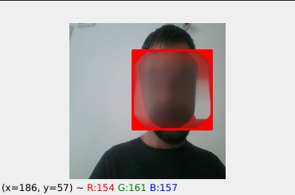
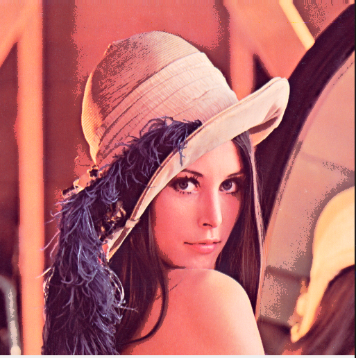
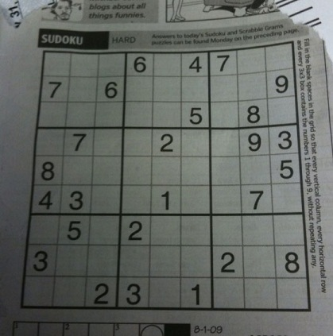
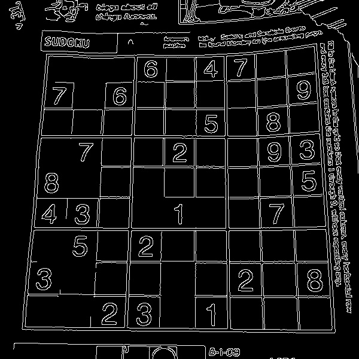
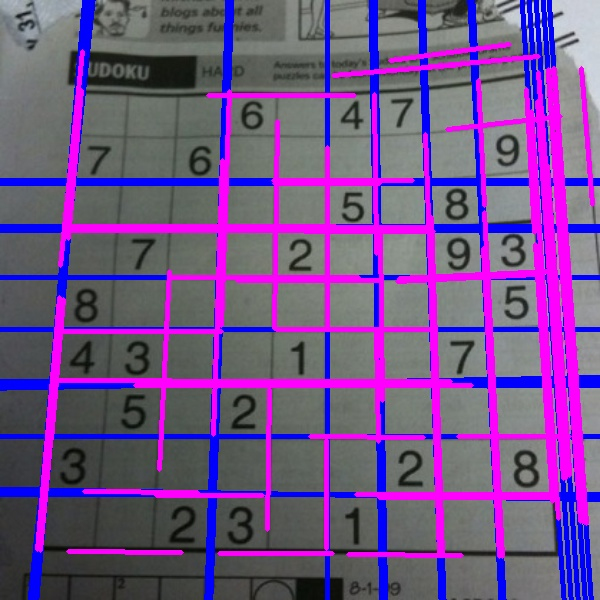

# image_processing_Assignment_26

<h2 align="center">Assignments</h2>

  - Median blur Face
  - increase of Contrast in video and detect color(Black, white, gray)
  - increase of Contrast
  - detect numbers in sudoku game

<h2> Median blur Face </h2>

 

<h2> increase of Contrast in video and detect color(Black, white, gray) </h2>

<h2> increase of Contrast </h2>

<h3 align="center"> befor processing </h3>

 

<h3 align="center"> after processing </h3>

- [x] **Contrast with ConvertScaleAbs**                

 

- [x] **Contrast with COLOR HSV2BG **                

 

<h2> detect numbers in sudoku game </h2>

<h3 align="center"> befor processing </h3>

 

<h3 align="center"> after processing </h3>

- [x] **edge detection with canny method**                

 

- [x] **show line in sudoku game **                

 
